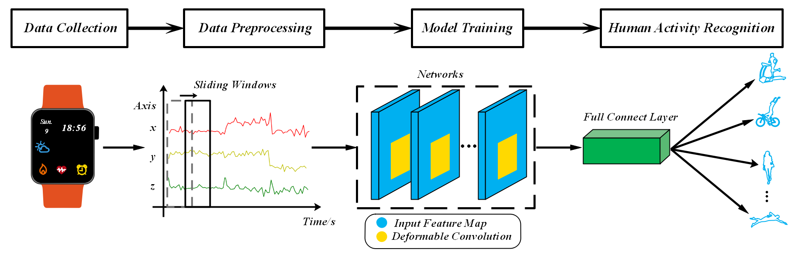
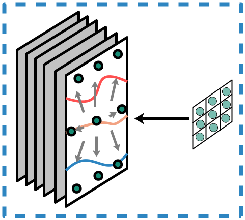

# Deformable-Convolution-for-HAR
### CITE: S. Xu, L. Zhang, W. Huang, H. Wu and A. Song. Deformable Convolutional Networks for Multimodal Human Activity Recognition using Wearable Sensors[J]. IEEE Transactions on Instrumentation and Measurement, vol. 71, pp. 1-14, 2022. 

  

 

  

 

### Here shows the model architecture and the simplfied TRAIN process on benchmark public datasets. Thanks for pointing out improper!
### Requirements in this work
1. Python 3.8 
2. PyTorch 1.8.2 + cu111
3. Numpy 1.21.2

